# User Documentation

[PDF version](./gw3-prestashop-plugin.pdf)

## Installation
- Install module using standard PrestaShop module installer
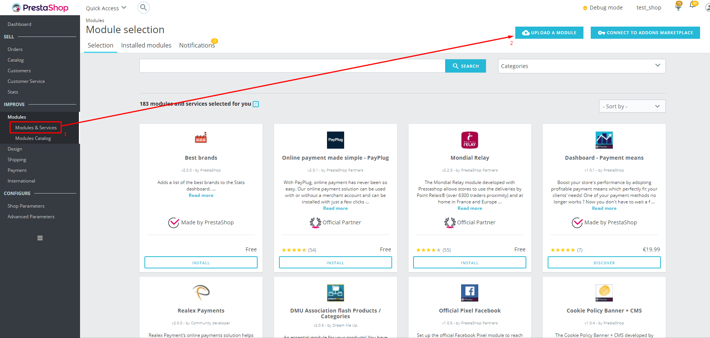

## Initial configuration
- Enable and configure module in PrestaShop admin 
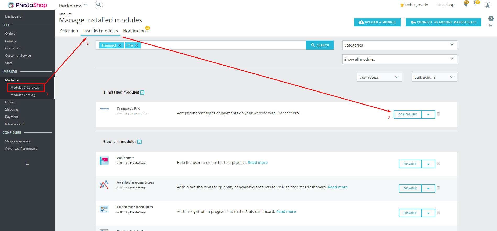

### Configuration
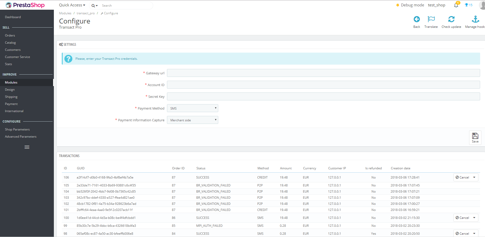

#### Settings
- `Gateway URL`: - Leave empty for sandbox mode (`https://api.sandbox.transactpro.io/v3.0`) or enter the information received from Transact Pro support team (usually it's `https://api.transactpro.lv/v3.0`)
- `Account ID`: - Specify your numeric Account ID received from the Transact Pro support team, the specific Account ID is related the whay payments being processed
- `Secret Key`: - Specify your Secret Key received from the Transact Pro support team 
- `Payment Method`: Choose payment method you want to use (`SMS` is most common used)
  Supported methods are:
    - SMS: Customer will charded imidiatelly, transaction can be reverted manually
    - DMS: Funds will be reserved, merchant can charge them or cancel manually
    - Credit: Funds will be transferred to merchant's credit card
    - P2P: Funds will be transferred to merchant's credit card using P2P method
- `Payment Information Capture`: Choose `Merchant Side` (credit card details will be entered on `Checkout` page) or `Payment Gateway Side` (client will be redirected to payment gateway page to enter credit card details). 
  **Note:** `Payment Information Capture` depends from `Account ID`, you need to set corresponded `Account ID` value for correct work.
  For example, you have following Account ID values:
    - 100: CARD DETAILS COLLECTED ON GW SIDE_3D_V     - That means Security 3D transactions, customer will be redirected to payment gateway to enter credit card information, you need to set `Payment Infomation Capture` as `Payment gateway side` 
    - 101: CARD DETAILS COLLECTED ON GW SIDE_NON 3D_V - That means non-3D transactions, customer will be redirected to payment gateway to enter credit card information, you need to set `Payment Infomation Capture` as `Payment gateway side` 
    - 200: CARD DETAILS COLLECTED ON API_3D_V         - That means Security 3D transactions, customer will enter credit card information directly on Checkout page, you need to set `Payment Infomation Capture` as `Payment gateway side` 
    - 201: CARD DETAILS COLLECTED ON API_NON3D_V      - That means non-3D transactions, customer will enter credit card information directly on Checkout page, you need to set `Payment Infomation Capture` as `Payment gateway side` 

### Transactions
See [Transaction handling](#transactions) section

### Global settings
**The Transact Pro gateway currently operates with Euro only!**
Please, configure your PrestaShop instance to operate Euro and configure restrictions to use the module:
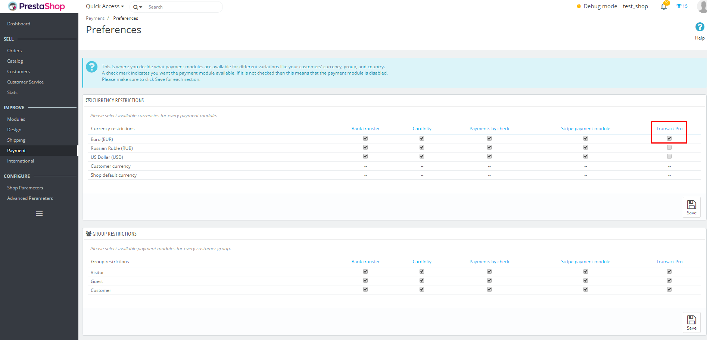
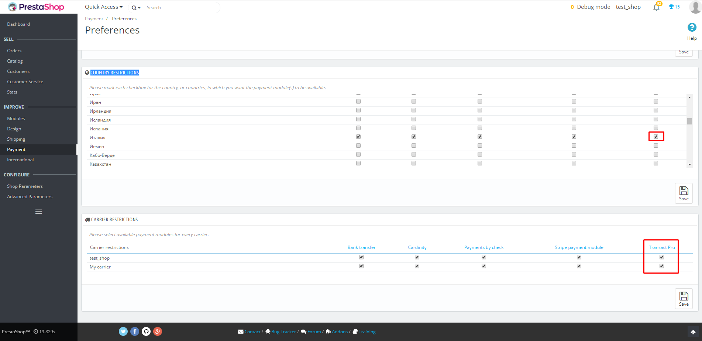
                                               
## Transaction handling

### Customer
#### Executing transaction
Select `Credit/Debit Card (Transact Pro)` 
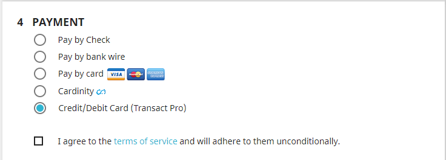

Fill card details (depends from the `Payment Infomation Capture` settings)
- directly on Checkout page:
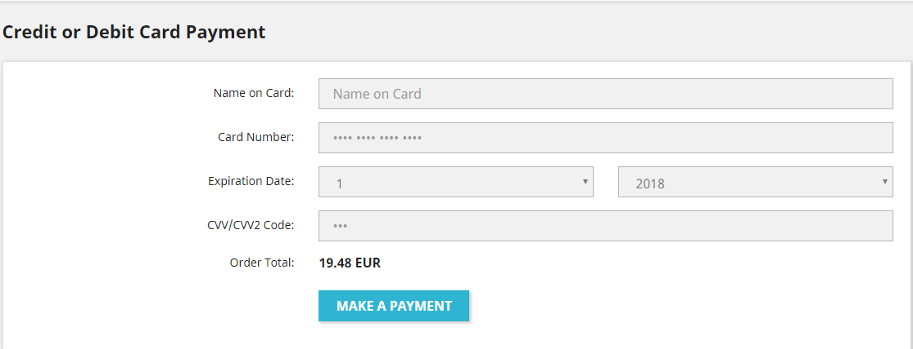
- or Payment Gateway page:
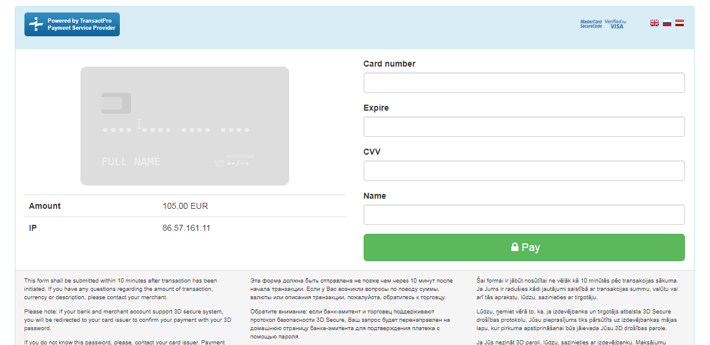

#### Check transaction status

### Merchant

#### Transaction list
Go to Transact Pro payment module settings:

Depends on transaction status and type, ypu can perform different operations. Some operations may be unavailable 
for some rows because of certain transaction status.

#### Charge transaction
Only `DMS` transaction with the status `DMS_HOLD_OK` can be charged
- Click `Charge` button for the corresponded transaction
  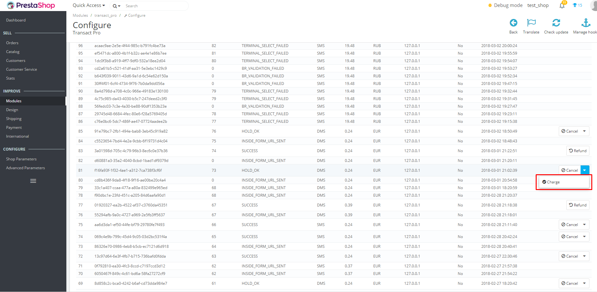

#### Cancel transaction
You can cancel `SMS` transaction with the status `SUCCESS` or `DMS` transaction with the status `DMS_HOLD_OK`
- Click `Cancel` button for the corresponded transaction
  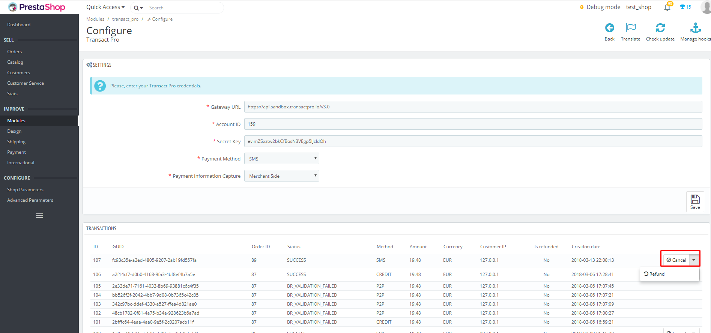

#### Refund transaction
Only `SMS` transaction with the status `SUCCESS` 
- Click `Refund` button for the corresponded transaction
  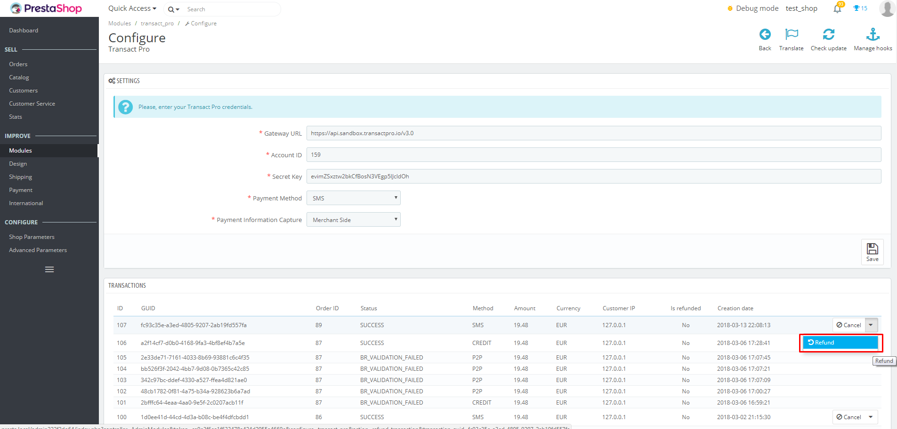
- Provide refund reason, refund amount and then click `Refund` button
  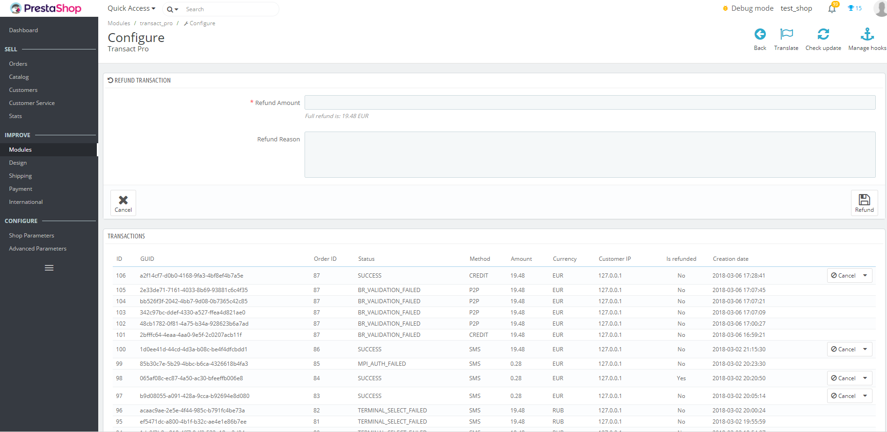

**Note:** Summary refunds amount can't be more than original transaction amount, otherwise payment gateway will reject the refund

#### Orders
Order statuses are automatically adjusted corresponded to the transaction statuses
You can check it using standard functionality of PrestaShop:
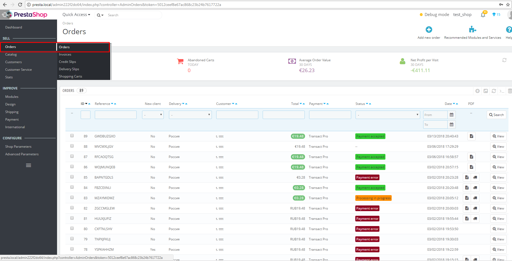
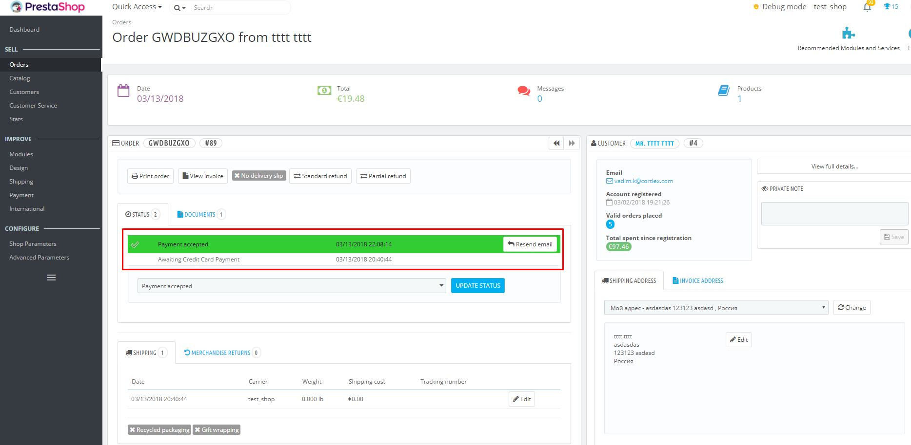
 

